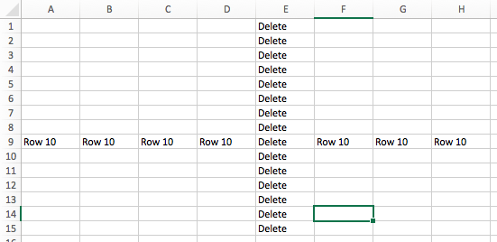
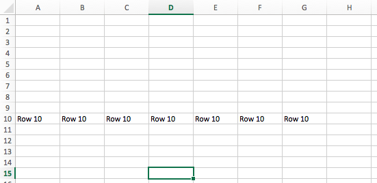

# Shift

A custom-built module via Openpyxl

## Summary
Shift is a Python Class that works with the openpyxl library to insert and remove rows and columns in Excel.

## Tools
- Python 3 (download it [here](https://www.python.org/downloads/))
- Openpyxl Library

## Getting Started
- Users will first have to import the openpyxl library on their system using pip. You can install in the terminal by inputting `pip install openpyxl`. Alternative installations are available [here](https://openpyxl.readthedocs.io/en/stable/)

- Once openpyxl is installed, you can [download](https://github.com/alexrogers823/openpyxl-shift/archive/master.zip) the Shift module manually, or input `git clone git@github.com:alexrogers823/openpyxl-shift.git` into the desired folder on your terminal.

## Using the Shift methods


When using class Shift in your program, you need your workbook and the specific row or column that you want to apply.

__Example 1: Inserting__

```
import openpyxl
from Shift.shift import Shift

workbook = openpyxl.load_workbook("Hello_World.xlsx")
worksheet = workbook.get_sheet_by_name("Python")

# Insert row at row 9 of worksheet
row_nine = Shift(worksheet, 9)
row_nine.insert_row()
```

__Example 2: Removing__

```
import openpyxl
from Shift.shift import Shift

workbook = openpyxl.load_workbook("Hello_World.xlsx")
worksheet = workbook.get_sheet_by_name("Python")

# Delete column at column E (5th column) of worksheet
column_E = Shift(worksheet, 5)
column_E.remove_column()
```

Once your program saves and opens excel, you will see the changes reflected.



## Author
Module written by [Alex Rogers](https://github.com/alexrogers823 "Alex Rogers' GitHub page")

## Acknowledgements
Special thanks to [Al Sweigart](https://twitter.com/AlSweigart), author of [Automate the Boring Stuff with Python](http://automatetheboringstuff.com/). The chapter on openpyxl is what inspired me to write this module.
